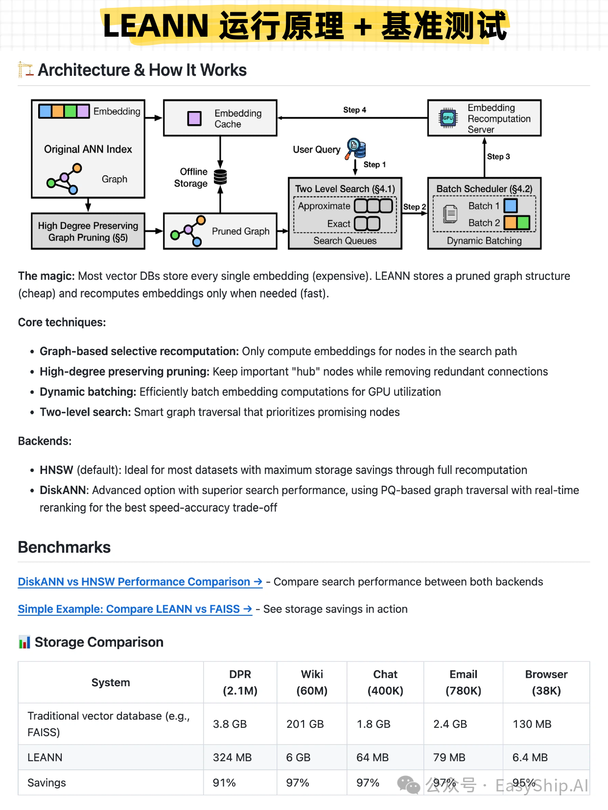

伯克利开源了一款最轻量级的向量数据库！伯克利大学 + 香港中文大学 + 亚马逊 AWS 云联合开发了一款最小的向量数据库：LEANN，其核心目标就是 RAG Everything（让 RAG 无处不在），主打极致节省存储空间，是能够在本地设备快速，准确，而且100%私有化运行的 RAG 应用；
⭐️ 项目给出了最直观的数据对比：6000 万字符的文本片段，传统向量库需要 200+GB的存储空间，而 LEANN 仅需 6GB；

🤖 其底层技术原理是基于 HNSW，类似于跳表分层的多层独立小世界图，最上层做粗粒度的全局导航，快速定位大致查询区域，越往下层走，检索的粒度越精细化，最终产出 Top‑K 的候选结果；
⭐️ LEANN  基于一个核心洞察，对 HNSW 进行了优化：传统 HNSW 检索时，每次查询只会访问整个图 0.1 - 1% 的节点，却把全部向量永久存磁盘，极度浪费存储；
- 所以，LEANN 不持久保存向量，只保留原始文本 + 节点的近邻图拓扑，通过分层 + 图的结构特性进行检索，遇到的节点先进行一遍粗筛，再批量提交原始文本实时计算嵌入值，获取精确的相似度；

🤖 其完整的嵌入过程是：
- 文本分块：切分文本块，每个块分配唯一 ID + 原始文本；
- 临时生成全量文本块的嵌入：用于构建图，不持久化存储；
- 使用标准 HNSW 算法，基于临时向量构建多层导航小世界图（每个节点存储分配的 ID 和邻接 ID 列表）；
- 选择出度比较高的节点作为枢纽 Hub 节点（前2%），作为全局导航的关键；
- 限制普通节点的出度上限，删除大量冗余边；
- 使用稀疏矩阵序列化表示图结构，压缩最终存储体积；

⭐️ 为了极致压缩存储空间，Leann 选择在检索阶段额外计算文本嵌入值，以及相似度，检索延迟会小幅上升；所以，更适合 RAG，本地知识库场景，不适合超高性能要求的在线服务；

原文： https://mp.weixin.qq.com/s/ZZXBOIOfFEXm2NP2YNIPQg