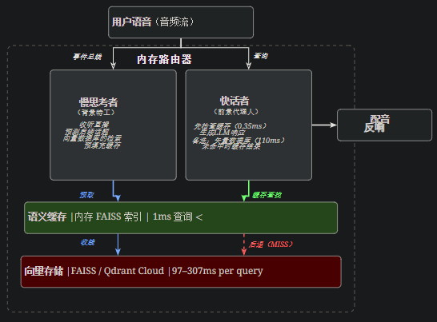

# VoiceAgentRAG：利用双代理架构解决实时语音代理中的RAG延迟瓶颈

邱解林张建国陈子祥梁伟·杨明珠谭军涛

陈浩林赵文廷里特什·穆尔蒂罗山·拉姆阿克沙拉·普拉巴卡尔

谢尔比·海内克凯明熊西尔维奥·萨瓦雷塞王

\(\)焕 Salesforce 人工智能研究

[**https://github\.com/SalesforceAIResearch/VoiceAgentRAG**](https://github.com/SalesforceAIResearch/VoiceAgentRAG)

https://ar5iv\.labs\.arxiv\.org/html/2603\.02206

###### **摘要**

检索增强生成（RAG）使语言模型能够基于外部知识来构建响应，但检索步骤引入了与实时语音对话不兼容的延迟。典型的向量数据库查询会为响应流水线增加50–300毫秒，结合嵌入计算和LLM生成，使总延迟远超自然对话流所需的200毫秒预算。我们介绍VoiceAgentRAG，一款开源的**双代理内存路由器**，能够将检索与响应生成解耦。一个后台的*Slow Thinker*代理持续监控对话流，利用大型语言模型预测可能的后续话题，并将相关文档块预先取入FAISS支持的语义缓存中。前景*快速通话*代理只读取该亚毫秒缓存，完全绕过向量数据库，满足缓存命中。我们以 Qdrant Cloud 作为生产向量数据库，在 10 个不同对话场景中，基于 200 查询基准测试评估 VoiceAgentRAG，实现**了 75% 的整体缓存命中率**（暖回合为 79%），并且**316×检索加速**（110毫秒）→缓存命中查询节省了0\.35毫秒，从而在150次缓存命中节省了16\.5秒的累计检索延迟。

## 1**简介**

语音AI代理的出现催生了一类新的实时系统，其中延迟成为一流的设计限制。与基于文本的聊天机器人用户能容忍多秒的响应时间不同，语音对话需要不到200毫秒的响应延迟才能感觉自然\[Ethiraj2025电信\]\.该预算必须涵盖整个流程：语音转文本（STT）、上下文检索、LLM生成和文本转语音（TTS）。

检索增强生成（RAG）\[刘易斯2020拉格\]已成为将LLM回答建立在领域特定知识基础上的标准方法。然而，检索步骤在语音管道中引入了关键的延迟瓶颈。生产向量数据库查询（例如，查询Qdrant\[QDRANT2024\]松果或Weaviate）通常会产生50–300毫秒的网络往返延迟，仅此一部分就可能消耗整个延迟预算。

现有的解决方法可分为三类，但都未能完全解决语音延迟的限制：

- • 

- **更快的检索基础设施。**优化向量指标（FAISS）\[约翰逊2019费斯\]，HNSW\[Malkov2016高效AR\]）减少搜索时间，但当数据库远程托管时，并未消除网络延迟，这也是常见的生产部署模式。

- • 

- 语**义缓存。**像GPTCache这样的系统\[GPTcache2023\]， QVCache\[gocer2025qvcache\]，以及语义旁移缓冲区\[Arslan2025aeon\]缓存之前的查询结果，但它们是被动的：只有当完全*相同*或非常相似的查询反复出现时才有用。

- • 

- **推测性检索。**Stream RAG\[arora2025streamrag\]以及Speculative RAG\[王2024specrag\]预测生成过程中要检索的内容，但它们只在单个查询的生命周期内运行，而不是跨对话回合。

我们提出了VoiceAgentRAG，这是一种受Kahneman的System 1/System 2框架启发的双代理架构\[Kahneman2011thinking\]以及近期关于双进程人工智能代理的研究\[张2025DPTagent,DU2025CDR\]\.关键见解是，在多轮语音对话中，*下一个问题往往可以从当前对话上下文中预测*。客户询问价格时，通常会跟进企业套餐、折扣或计费——这些话题可以在*当前回复中*提前获取，甚至在用户开口之前。

VoiceAgentRAG 由两个并发代理组成：

1. 1\. 

2. ***Slow Thinker*** 作为一个后台的异步任务运行。对于每个用户发言，它使用大型语言模型预测3到5个可能的后续话题，从向量数据库中检索相关文档块，并预填充FAISS支持的语义缓存。这项工作在用户听当前响应时在后台进行。

3. 2\. 

4. ***快速通话器***负责前台的用户查询。它首先检查语义缓存（亚毫秒查找），只有在缓存未命中时才回退到向量数据库。当它回退时，会缓存检索到的结果以供未来查询使用。

我们的贡献包括：

- • 

- 一款开源的双代理内存路由器，用于语音代理，实现检索与响应生成的解耦。

- • 

- 文档嵌入索引语义缓存，实现亚毫秒级查找且语义匹配正确。

- • 

- 在生产Qdrant Cloud部署中，涵盖10个对话场景的200查询综合评估，展示了75%的缓存命中率和316×取回加速。

- • 

- 分析缓存行为，涵盖对话深度、话题模式以及冷启动/热启动条件。

## 2**方法**

### 2\.1**架构概述**

VoiceAgentRAG 围绕五个核心组件组织，如[图 ̃ 1](https://ar5iv.labs.arxiv.org/html/2603.02206#S2.F1) 所示：（1） 负责系统的**内存路由器**，（2） 提供异步事件总线的**会话流**，（3） 一个 ***Slow Thinker*** 后台代理，（4） ***快速通话***者前台代理，以及 （5） 由内存内 FAISS 索引支持的**语义缓存**。

图1：VoiceAgentRAG 的架构。*慢思考者*（左）持续监控对话流，预测后续话题，从向量存储中检索数据，并填充语义缓存。*快速通话器*（右）先检查缓存（1毫秒），绕过向量存储器以获得命中。未命中时，它会退回直接检索（红线），并缓存结果以供后续查询使用。\<

数据流程如下。当用户说话时，内存路由器会向对话流发布一个用户话事件。两位代理同时接收该事件：

- • 

- *快速通话器*会立即嵌入查询，检查语义缓存，然后要么提供缓存上下文（命中）或退回向量存储（命中）。然后它生成一个流式LLM响应。

- • 

- *Slow Thinker*（作为后台的异步任务）处理相同的话语：它获取当前查询的上下文，通过LLM预测后续主题，并将这些预测的文档块预先取入缓存。

由于*慢思考者*是异步操作的，其预取过程与当前回合的响应生成和用户的听/思考时间重叠。当用户提出下一个问题时，相关上下文已经在缓存中。

### 2\.2**语义缓存**

语义缓存是两个代理之间的关键桥梁。它以内存内FAISS IndexFlatIP（L2归一化向量的内积，等同于余弦相似度）实现，存储由*自身*嵌入索引的文档块。

**为什么要用文档嵌入？**早期设计通过*预测查询的嵌入*对缓存条目进行索引。这会产生缓存“命中”，返回的是无关的区块，比如预测“价格详情是什么？”会缓存定价区块，但当用户询问“年度计费有折扣吗？”时，缓存返回的是一般价格信息，而非折扣专属内容。通过文档嵌入索引，缓存对缓存中的文档块进行适当的语义搜索，返回与实际用户查询最相关的块。

缓存支持以下操作：

- • 

- **Put**：存储一个文档块及其嵌入、相关性评分、元数据和TTL。近似重（余弦相似性）\>0\.95）被检测并更新，而不是添加。

- • 

- **获取**：给定查询嵌入，返回顶部——k余弦相似度高于阈值的缓存块τ\.该操作为\<1MS缓存为100\+条目。

- • 

- **驱逐**：参赛时间根据时间长（TTL）过期（默认时间：300秒）。当缓存达到最大大小时，最近访问最少的条目被驱逐（LRU策略）。

**阈值调谐。**相似阈值τ是一个关键参数。我们发现查询到文档的余弦相似度（使用 OpenAI 文本嵌入\-3\-small）通常范围在 0\.30 到 0\.55 之间，明显低于查询间的相似度。通过实证分析（[第4\.5节](https://ar5iv.labs.arxiv.org/html/2603.02206#S4.SS5)），我们确定τ=0\.40作为默认，平衡了精度（避免无关上下文）和回忆（捕捉有用匹配）。

### 2\.3**慢思考者：预测性预取**

*慢思考者*订阅对话流，并按以下方式处理事件：

**关于 UserUtterance：**

1. 1\. 

2. **直接检索**：嵌入当前话语并检索顶部——k从向量存储器中记录块。用自己的嵌入缓存每个区块。

3. 2\. 

4. **预测**：利用LLM预测n根据对话历史（最近6回合的滑动窗口）最有可能的后续话题。提示指示LLM生成文档式描述而非问题，从而生成更接近实际文档内容的嵌入。

5. 3\. 

6. **预取**：对每个预测，嵌入它，搜索向量存储，缓存结果。这些操作通过 asyncio\.gather 并行运行。

**在优先检索**（由*Fast Talker*缓存未命中触发）：立即检索，顶部扩展——k\(2×默认）以便快速填充缓存，围绕遗漏的主题进行填充。

**速率限制**：为避免向量存储和嵌入API过载，*Slow Thinker*强制执行预测间隔最小（默认：0\.5秒）。

### 2\.4**快速通话器：缓存优先响应**

*快速通话器*负责关键延迟路径。对于每个用户查询：

1. 1\. 

2. **使用**嵌入 API 嵌入查询 （∼远程API需要200毫秒）。

3. 2\. 

4. **缓存查找**：在语义缓存中搜索顶部——k相似的块≥τ \(\<1MS）。

5. 3\. 

6. **如果缓存命中**：将缓存区块格式化为上下文，生成LLM响应。*完全跳过矢量商店。*

7. 4\. 

8. **如果缓存未命中**：退回到直接向量存储搜索，生成响应，缓存*检索结果*，使下一个类似查询进入缓存。还可以通过优先检索事件*向慢思考者*发出信号。

未中缓存行为至关重要：这意味着对任意主题的首次查询会对缓存进行引入，之后所有关于该主题的查询都可以从缓存中提供。结合*慢思考*者的预测预取，形成了一种复合效应，让宝藏在前几回合迅速升温。

### 2\.5**会话流**

会话流是通过asyncio实现的异步事件总线。排好队。它支持五种事件类型：用户发话（UserUtterance）、代理响应（AgentResponse）、静默检测（SilenceDetected）、主题转换（TopicShift）和优先检索（PriorityRetrieval）。滑动窗保持最后一个N对话转向（默认：10）以适应*慢思考者的*预测语境。

## 3**实验装置**

### 3\.1**知识库**

我们构建了一个综合企业知识库，用于“NovaCRM”，一个虚构的AI驱动CRM平台。知识库包含12份文档，内容涵盖：公司概览、产品特性、定价计划、API文档（概述、联系人端点、优惠端点）、集成、安全与合规、入职指南、故障排除指南、常见问题解答以及发布说明。通过递归字符拆分器（分块大小：512，重叠：50）分块后，知识库包含**76个文档分块**。

我们选择了合成知识库而非真实世界数据集，以保证可重复性和受控评估。内容设计成自然的主题集群（定价、API、安全等），以反映真实的企业文档。

### 3\.2**向量存储**

我们使用 **Qdrant Cloud** 作为生产向量数据库，部署在 AWS us\-west\-2 上。这为检索操作提供了真实的网络往返延迟，而非模拟延迟。测量的搜索延迟为每次查询97–307毫秒（平均120毫秒），代表生产部署阶段。

对于嵌入，我们使用通过 Salesforce Research Gateway 的 OpenAI 文本嵌入\-3\-small（1536维）。

### 3\.3**大型语言模型**

所有大型语言模型操作（响应生成、主题预测、关键词提取）均使用 **GPT\-4o\-mini**。响应生成和预测时温度设置为0\.3。

### 3\.4**对话场景**

我们设计了**10个多样化的对话场景**，每个场景有**20个回合**，总共**200个查询**。这些场景涵盖了真实客户支持通话中观察到的不同对话模式：

1. 1\. 

2. **新客户概览**：广泛探索多个主题。

3. 2\. 

4. **定价深度分析**：20回合完全聚焦于定价。

5. 3\. 

6. **API集成**：深入技术层面的API文档。

7. 4\. 

8. **安全与合规**：企业安全问题。

9. 5\. 

10. **入职操作指南**：逐步设置指导。

11. 6\. 

12. **故障排除环节**：针对错误场景进行问题解决。

13. 7\. 

14. **集成问题**：功能目录浏览。

15. 8\. 

16. **功能比较**：跨产品领域的广泛功能巡回。

17. 9\. 

18. **现有客户升级**：计划对升级进行比较。

19. 10\. 

20. **混合速问**：随机提问，中间有短暂停顿。

转间延迟时间范围为3至7秒，模拟人类语音和思考时间的自然节奏。这让*慢思考者*每回合有3–7秒的时间进行背景预取。

### 3\.5**评估协议**

对于每种情景，我们会进行两次对话：

- • 

- **传统RAG（基线）：**每个查询都经过完整的流水线：嵌入→Qdrant搜索→LLM生成。

- • 

- **VoiceAgentRAG（双代理）：**后台运行的“*慢思考者*”;*快速通话者*首先检查缓存。

我们测量：（1）缓存命中率，（2）检索延迟（向量存储搜索与缓存查找），（3）缓存大小增长，（4）总响应时间。我们报告检索延迟为主要指标，因为它隔离了双代理架构优化的组件，而总响应时间则受LLM生成方差（500–8000毫秒）主导。

## 4**选举结果**

### 4\.1**整体表现**

[表1](https://ar5iv.labs.arxiv.org/html/2603.02206#S4.T1)总结了所有200次查询的结果。双代理架构实现**了75%的整体缓存命中率**（150/200查询），在**热缓存回合中达到79%**（150/190，不包括冷启动），其**316×检索加速**在缓存命中查询（110毫秒）时→在150次缓存中，总共节省**了16\.5秒**的检索延迟。

表1：使用 Qdrant 云，在 10 个对话场景下，200 次查询的整体性能。所有测量均基于真实网络往返，没有模拟延迟。

### 4\.2**每场景分解**

[表2](https://ar5iv.labs.arxiv.org/html/2603.02206#S4.T2)显示了每个对话场景的缓存命中率。单一主题深度分析（API集成、安全性）达到最高命中率（80–100%），而广泛探索场景（新客户概览、混合快速响应）则较低（40–60%）。这是意料之中的：*慢思考者的*预测在话题集中时更准确。

表2：按对话场景（每个20回合）按缓存命中率排序。持续主题的场景比频繁转移主题的场景获得更高的命中率。平均检索显示Qdrant Cloud搜索延迟。

### 4\.3**缓存预热动态**

[表3](https://ar5iv.labs.arxiv.org/html/2603.02206#S4.T3)展示了缓存点击率如何随着对话深度的变化而变化。第一弯总是失败（冷启动）。到第5至10回合，命中率迅速提升至70–80%，这是慢*思考者的*预测预取和*快速对话者的*“未中缓存”行为组合的结果。

表3：按对话深度划分的缓存命中率（涵盖所有10个场景，总共200次查询）。第一弯总是失败（冷启动）。在第5至9回合时，宝藏命中率达到86%。

### 4\.4**检索延迟分析**

在缓存命中回合，检索路径为：

- • 

- **传统RAG**：Qdrant云搜索 = **平均110\.4毫秒**（范围：97–307毫秒）。

- • 

- **VoiceAgentRAG**：FAISS 内存缓存查找 = **平均 0\.35ms** 。

这表示一个**316×加速**在取回步骤上。在150次缓存命中查询中，总共消除**了16\.5秒**的检索延迟。在总预算为200毫秒的语音管道中，每次查询节省110毫秒的检索延迟，就是自然对话与不自然对话之间的区别。

在缓存未命中匝道时，两个系统承受相同的Qdrant延迟。然而，*快速话者*缓存未命中（cache\-on\-miss）行为确保同一主题的后续查询能从漏接中受益。

### 4\.5**阈值敏感性分析**

缓存相似度阈值τ控制缓存精度和命中率之间的权衡。[表4](https://ar5iv.labs.arxiv.org/html/2603.02206#S4.T4)展示了不同阈值对20回合语音通话模拟的影响。

表4：缓存相似度阈值的影响τ关于命中率。查询到文档的余弦相似度通常在 OpenAI 文本嵌入 3\-small 之间为 0\.30–0\.55。0\.40的阈值平衡了精确度和召回率。

我们的阈值分析得出的见解是，查询到文档的余弦相似度系统性地低于查询之间的相似度。这是因为文档块是描述性散文，而查询则是简短的问题。为查询\-查询匹配校准的阈值（0\.55\+）对于查询\-文档匹配来说过于严格。

## 5**讨论**

### 5\.1**架构什么时候会有帮助？**

双代理架构在以下情况下提供最大价值：

- • 

- **向量数据库是远程**的：Qdrant 云端节省了112毫秒的延迟，效果显著。对于拥有76份文件的本地FAISS，搜索时间为0\.1毫秒——几乎可以忽略不计。

- • 

- **对话主题连贯**：单一主题深度探讨可达80%\+点击率。随机快速提问只能获得40%。

- • 

- **有足够的回合间隔时间**：*慢思考者*需要3–7秒完成预测\-检索\-缓存循环。快速的来回交替（2秒）会降低收益。\<

### 5\.2**冷启动缓解**

第一次查询总是失败，因为缓存是空的。然而，*快速通话器的*缓存未命中行为会立即启动缓存，慢*思考者*开始预测性预取。到第3至4回合，缓存通常已足够温暖，能够处理大多数查询。

对于冷启动延迟至关重要的应用，可以通过预取最常用的文档块（例如，顶部——k按历史对话检索频率的块）。

### 5\.3**局限性**

**LLM的生成主导了总延迟。**即使检索速度加快，端到端响应时间仍以LLM生成为主（通过API使用GPT\-4o\-mini时为500–8000毫秒）。虽然节省了112毫秒的检索，对语音延迟预算来说意义重大，但在整体响应时间测量中由于LLM的方差性，这些节省几乎看不见。使用更快的推理（例如Groq在840\+标记/秒）或局部模型，将使检索节省成为主导因素。

**预测准确性。***慢思考者的*预测并不总是准确，导致预取操作浪费。*Slow Thinker* 每回合可预测 5 次，每个预测需 10 块，因此占用大量嵌入 API 带宽。更轻量化的预测策略（如关键词提取而非大型语言模型预测）可以降低这一成本。

**缓存一致性。**如果对话过程中底层知识库发生变化，缓存条目可能会变得过时。基于TTL的到期时间提供了最终一致性，但不立即实现一致性。

### 5\.4**与现有系统的比较**

目前没有任何开源系统实现了语音代理的完整双代理预测预取架构。[表5](https://ar5iv.labs.arxiv.org/html/2603.02206#S5.T5)比较了VoiceAgentRAG与相关方法。

表5：VoiceAgentRAG与相关方法的比较。VoiceAgentRAG 是唯一将主动（预测）缓存与专用后台代理结合，实现语音优化检索的系统。

## 6**相关工作**

### 6\.1**RAG与检索延迟**

拉格\[刘易斯2020拉格\]通过检索上下文增强LLM生成，提高知识密集型任务的事实准确性。然而，标准的RAG流水线（嵌入查询）→搜索向量数据库→生成响应）本质上是顺序的，使得每一步都成为延迟瓶颈。

有几部作品关注检索效率。照明弹\[江2023flare\]利用前瞻性预测决定*何时*检索，减少不必要的检索。自我拉格\[asai2023自嘲\]训练模型以自适应判断是否需要检索。投机性反抗\[王2024specrag\]使用较小的模型并行起草多个RAG响应，由更大的模型进行验证。RaLMSpec\[张2024 RALMSPEC\]应用推测执行来检索，预取可能需要的文档。Stream RAG\[arora2025streamrag\]它能与用户语音并行预测工具查询，实现工具使用延迟的20%降低。

我们的工作与这些有两个不同之处：（1）我们*跨*对话回合而非单一查询，利用回合间自然暂停进行背景预取;以及（2）我们特别针对语音代理的使用场景，其中延迟预算以数十毫秒计量。

### 6\.2**LLM的语义缓存**

语义缓存是按查询意义而非精确匹配来索引的先前结果。GPTCache\[GPTcache2023\]为基于嵌入的相似性提供开源的LLM响应语义缓存。QVCache\[gocer2025qvcache\]引入了近似最近邻搜索的查询感知缓存，实现40–1000×延迟减少。语义侧面缓冲区（Aeon）\[Arslan2025aeon\]利用会话局部性实现5微秒以下的检索。

我们的语义缓存与这些系统不同，它由*Slow Thinker主动填充*，而非被动填充之前的查询。我们还通过*文档嵌入*而非查询嵌入来索引缓存条目，确保缓存在任何查询中返回最相关的文档块，无论最初哪个预测获取了这些数据。

### 6\.3**人工智能代理的双进程架构**

系统1/系统2与认知科学的区别\[Kahneman2011thinking\]启发了多个人工智能代理架构。DPT代理\[张2025DPTagent\]采用有限状态机实现系统1的快速决策，采用异步反射进行系统2的推理，实现实时人机与人工智能的协作。认知决策路由\[DU2025CDR\]引入元认知层，将查询路由到快速或慢速处理路径，降低了34%的计算成本。

混合\-RACA\[xia2023 hybridraca\]是最接近我们方法的：它使用客户端模型进行即时响应，而云模型则异步丰富内存。然而，它主要针对文本预测而非语音代理，且不实现知识库内容的预测预取。

### 6\.4**语音代理框架**

多个开源框架支持构建语音AI代理。LiveKit 代理\[LiveKit2024\]提供基于WebRTC的实时语音管道，并附有RAG示例。派普猫\[Pipecat2024\]为语音AI提供可组合的流媒体流管。Ultravox\[UltraVox2024\]通过语音原生多模态LLM完全消除了STT步骤。像Vapi和Retell这样的商业平台提供托管语音RAG服务。

这些框架都不实现背景预测预取。它们在查询到达时同步执行检索，因此每回合都承受向量数据库的全部延迟。

## 7**结论**

我们介绍了VoiceAgentRAG，一款双代理内存路由器，解决了实时语音代理中的RAG延迟瓶颈。通过将检索解耦到主动预获取上下文的后台慢*思考器*和从亚毫秒语义缓存读取的前景*快速通话*器，VoiceAgentRAG 实现了 75% 的整体缓存命中率（暖回合为 79%），达到 316×相比直接向量数据库搜索，检索速度更快，累计检索延迟节省了超过16秒，涵盖200次查询。

我们对10种不同对话场景中200个查询的评估表明，该架构在主题连贯对话中最为有效（深度场景中命中率为80%\+），并且可随检索延迟扩展：向量数据库延迟越高，缓存价值越高。

该系统以开源代码库形式发布，支持多个大型语言模型提供商（OpenAI、Anthropic、Gemini、Ollama）、向量存储（FAISS、Qdrant）和语音集成（Whisper STT、Edge TTS）。代码和基准测试可在 [https://github\.com/SalesforceAIResearch/VoiceAgentRAG](https://github.com/SalesforceAIResearch/VoiceAgentRAG) 获取。

## **参考文献**

## 附录A**系统配置**

[表6](https://ar5iv.labs.arxiv.org/html/2603.02206#A1.T6)列出了所有实验中使用的默认配置参数。

表6：VoiceAgentRAG 的默认配置参数。

