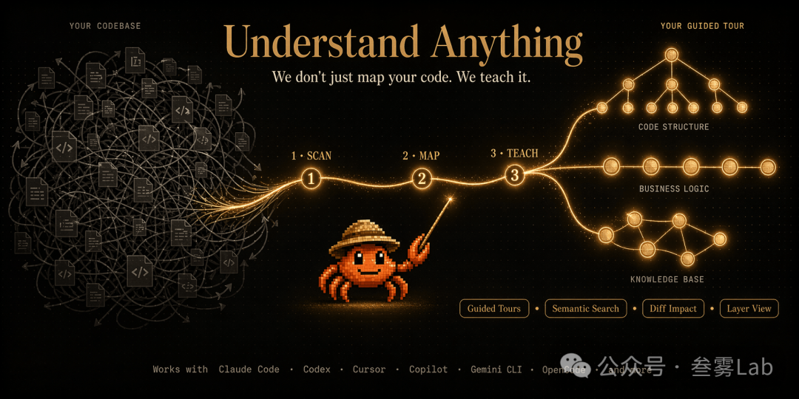
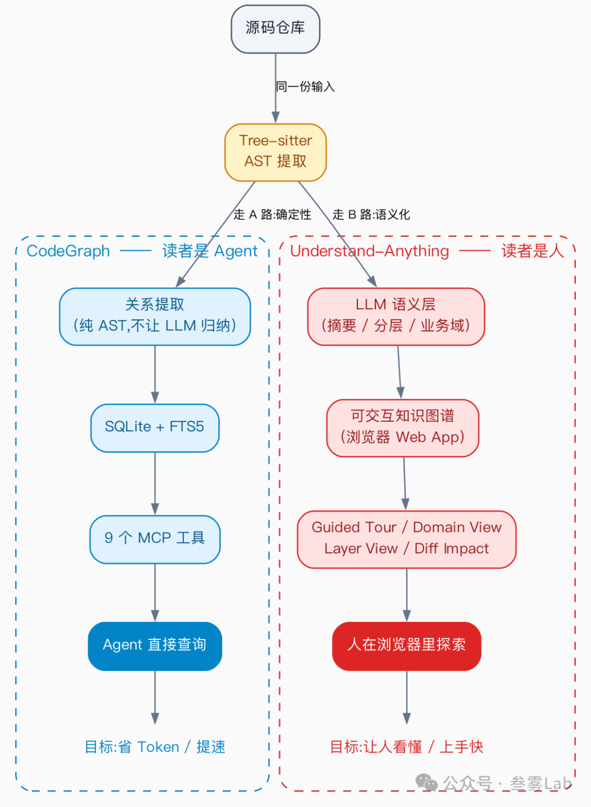

相关链接
• 项目主页：https://github.com/Lum1104/Understand-Anything
• 在线 Demo：https://understand-anything.com/demo/
• 官网：https://understand-anything.com

（图源：项目 README。左边是一团乱的代码文件，中间小螃蟹用三步 Scan → Map → Teach 把它们整理成右边的 Guided Tour。Tagline："We don't just map your code. We teach it."）

之前讲过 CodeGraph —— 用 tree-sitter 提 AST、存进本地 SQLite、走 MCP 协议喂给 Claude Code / Codex 这类 Agent，让 Agent 少摸索代码、省 Token。19.7k stars。

Lum1104/Understand-Anything 这两个月冲到 34.9k stars，技术栈几乎一样（tree-sitter + 代码图谱 + 多 Agent CLI 集成），但它做的是相反的事 —— 把图谱从给 Agent 看，扭回来给人看。

一、技术栈同源，服务对象相反

（同一份源码经过 tree-sitter 提 AST 之后，按"读者是谁"分叉成两条路径）

CodeGraph 的整条管线优化"Agent 读图谱"的体验：MCP 工具调用要快、要准、要可信，所以不让 LLM 介入归纳。

Understand-Anything 的整条管线优化"人读图谱"的体验：要可视化、要分层、要有引导、要能教学。

两条路上分歧最大的一步在 LLM 的角色。

二、关键差异：LLM 是否介入归纳
CodeGraph 故意把 LLM 排除在归纳之外 —— AST 直接出节点和边，Agent 拿到的就是确定性的查询结果，不需要二次验证。作者在仓库的 CLAUDE.md 里明示："Trust codegraph results, don't re-verify with grep."

Understand-Anything 押的是反方向：让 LLM 参与语义层。

• AST 给出"哪些函数调用了哪些" —— 这是结构
• LLM 进来回答"这个模块是干什么的" —— 这是语义
它把这层语义喂进图谱节点，所以节点内容变厚：除了"函数签名 + 行号"，还挂上了摘要、所属业务域、所在分层（API / Service / Data / UI / Utility）。

代价也很直接：图谱质量绑定 LLM 的回答质量。LLM 漏掉一个关键的业务域，或者把分层判错，整张图就跟着错。CodeGraph 选确定性是为了让 Agent 信；Understand-Anything 选语义是为了让人看得懂。两边都成立。

三、四种视图
图谱之上叠了四种切片，各对应一类读者：

视图
看什么
谁会想用
Guided Tour	
按依赖顺序的学习路径，从入口走到核心
新人接手项目第一周
Domain View	
按业务域而非技术目录组织（订单 / 支付 / 库存，不是 controllers / services）
PM 想理解某个业务怎么实现
Layer View	
按分层切（API / Service / Data / UI / Utility）
架构师想看分层是否清晰
Diff Impact	
一次改动可能影响哪些节点
Reviewer 看 PR 风险面
这四种是 CodeGraph 没有的 —— 因为 CodeGraph 给 Agent 用，Agent 不需要"切片"，Agent 自己会按需要查询。但人不行：人需要先看一张"整体"再下钻，所以 Understand-Anything 在图谱之上又叠了这层视图层。

另外还有 12 种编程模式的上下文解释（Singleton / Factory / Observer 等出现时自动标注）—— 这层是教学导向的，跟"省 Token"完全两回事。

四、适用场景与两者怎么选
两个工具不冲突，可以同一个项目里都装：CodeGraph 给 Agent 用，Understand-Anything 给团队成员用。具体场景：

场景
用谁
每天用 Claude Code / Codex 改代码，想让 Agent 少摸索
CodeGraph
新人入职第一周要看懂一个大仓库
Understand-Anything
代码评审，想知道一个 PR 影响范围
两个都行（CodeGraph 的 codegraph_impact vs UA 的 Diff Impact 视图）
PM / 架构师想脱离代码细节看业务域
Understand-Anything
（Domain View）
想集成进 MCP 让 Agent 直接调用
CodeGraph
（它本就是 MCP-first）
团队 onboarding 文档总是没人写，想让 AI 帮着自动出
Understand-Anything
（Guided Tour 就是这件事）
安装两个的总体成本不高 —— CodeGraph 是 npx @colbymchenry/codegraph 一行装好；Understand-Anything 在 Claude Code 里 /plugin install understand-anything，或者一键脚本接入其他 CLI。

五、几点尚待验证的疑问
• LLM 摘要的质量怎么保证？ Understand-Anything 用 LLM 做语义层，意味着摘要不一定对。项目目前没披露评估机制，使用者得自己核对关键模块的描述
• 超大仓库怎么办？ README 提到大图谱要走 git-lfs（10MB+）。增量更新只重分析变更文件，但首次扫描 + LLM 摘要的开销是真实的，可能要等
• 30 个 open issue + 40 个未合并 PR：热度涨得很快，维护节奏会不会跟不上需要观察
• 跟 GitHub 自家的 code search、Sourcegraph 比，差异在哪？ 那些是商业工具，UA 是开源 + 本地跑 + LLM 智能层。如果质量稳定，会形成"穷人的 Sourcegraph"位置
• Web UI 移动端体验未知：目前主入口是浏览器 web app，手机上能不能用没有明确说
结语
CodeGraph 和 Understand-Anything 押的是同一项技术（tree-sitter 提 AST、做成可查询的图谱），但分别下了不同的赌：

• CodeGraph 赌"图谱主要给 Agent 用" → 优化 Agent 体验（确定性、MCP 工具、不让 LLM 介入归纳）
• Understand-Anything 赌"图谱主要给人用" → 优化人的体验（可视化、Guided Tour、LLM 语义层）
谁对谁错不重要。两个赌都成立，因为代码理解的需求在两侧都真实存在 —— 工程师写代码时不想让 Agent 慢吞吞地摸索，团队新人接手项目时希望有人手把手带读。

值得注意的是，这两个项目的 Stars 加起来超过 50k，且都来自同一项技术栈（tree-sitter + 图谱 + MCP）。这暗示一件事：代码图谱这个底层能力在 AI Coding 时代正在变成基础设施，上层会按"谁来读"长出更多分叉的产品 —— 给 Agent 的、给人的、给 PM 的、给 SRE 的。

# 参考

https://mp.weixin.qq.com/s?__biz=MzYzNDkyODcxNg==&mid=2247483700&idx=1&sn=5633d01262953884e5bfb5e4d763c3f0&scene=21&poc_token=HDRVX2qjCMLoD_vtktKPXqbpF5vyFGTmN2I6xzAL