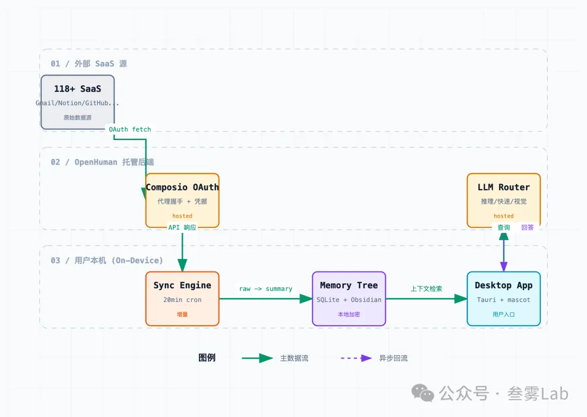
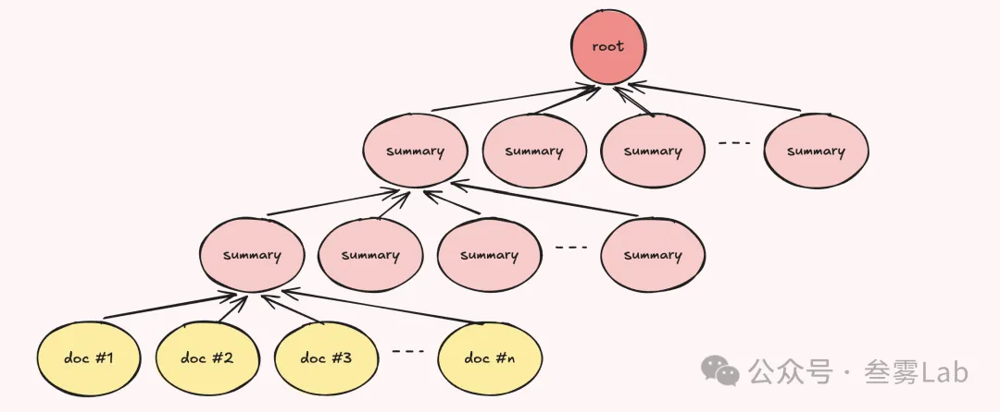

相关链接
-  项目主页:https://github.com/tinyhumansai/openhuman
-  官网:https://tinyhumans.ai/openhuman
-  文档:https://tinyhumans.gitbook.io/openhuman/
-  作者:https://twitter.com/senamakel

一、它对准的"老问题"
• 每次开新对话,助手不知道你是谁。 你重复贴入背景,它每次都要重新"理解"
• 数据散在 100 个工具里。 Gmail 里有客户邮件,Notion 里有产品文档,Linear 里有项目进度,Slack 里有团队讨论。AI 看不到任何一个
• 临时拉取也来不及。 就算给 AI 装上工具,它问的时候才去 fetch,慢且经常 stale
• 自己集成贵且烦。 每个 SaaS 都要写一遍 OAuth 接入,养一个 webhook 端点
OpenHuman 的立意是:"认识你"应该是后台持续进行的,不是开对话时按需触发的。 这是它整套设计的出发点,后面三个赌注都从这里推下来。

二、它怎么 work(整体架构)

OpenHuman 整体架构
按 trust zone 分成三层:

• 外部 SaaS 源(上):你接入的 118+ 第三方服务,只是数据来源
• OpenHuman 托管后端(中):Composio OAuth 代理 + LLM Router。控制流必经之地,默认配置下你的每个查询和模型选择都过这里
• 用户本机(下):Sync Engine → Memory Tree → Desktop App 整套数据加工和存储,raw data 不出本机
数据进:外部 SaaS → Composio OAuth → Sync Engine(每 20 分钟拉一次)→ 切块摘要 → 存进 Memory Tree。

用户用:Desktop App 从 Memory Tree 取上下文 → 发查询给 LLM Router → 模型回答。

后面三节展开讲架构里的关键设计赌注、实际使用场景、和这个架构留下的"现实成本"。

三、它的三个核心赌注
之所以叫"赌注"而不是"功能",是因为每条都有明确的 trade-off,不是免费午餐。

赌注 1:118+ OAuth 集成 —— 一次授权,长期受益
支持 Gmail、Notion、GitHub、Slack、Stripe、Calendar、Drive、Linear、Jira 等 118+ 个第三方服务,通过 Composio connector 层做的一键 OAuth。装上之后授权一次,之后所有这些数据都会自动入库。

Trade-off:你给一个未深度试用的项目授权了 100 个 SaaS。信任链多了一环,token 安全策略要看 OpenHuman 怎么处理。

赌注 2:Memory Tree —— 不是普通 RAG
数据进来后,不是塞向量库,而是切成 ≤3k token 的 Markdown 块,做层级化摘要,存进本地 SQLite。同时维护一份 Obsidian 风格的 Markdown vault,你自己也能直接打开看。

Memory Tree 数据结构示意
底层是原始文档(yellow,doc #1...#n),向上每层做一次合并摘要,最终汇成一个 root。检索时不是傻搜底层,而是顺着树往下找最相关的分支,把对应的 summary 段给 LLM。

这个设计的好处:

• 出问题能 debug。Markdown 块是人可读的,RAG 的嵌入向量是黑盒
• 双重用途。你不光给 AI 用,自己也能当"二手大脑"翻
• 摘要可读可改。AI 错了你能直接改源
Trade-off:层级摘要本身有信息损失。原邮件 5000 字摘到 500 字,关键细节可能掉。

赌注 3:20 分钟自动同步 —— "持续认识"而不是"按需访问"
后台每 20 分钟从所有接入的服务拉新数据,刷新 Memory Tree。你问 AI 时,它用的是"最近的你",而不是"装的时候那一刻的你"。

Trade-off:同步窗口 = 不是严格实时。你刚发完一封邮件马上问 AI,它可能还看不到。实时 webhook 触发是有的,但必须走他们托管后端。

四、装上之后能干什么(具体场景)
抽象赌注落到地上,大致是这几种用法:

场景 1:跨工具问问题

"上周客户邮件确认的那个需求,Jira 上现在做到哪一步了?"

不用 OpenHuman 时,你得切到邮箱翻那封邮件找上下文 → 切到 Jira 翻对应 ticket → 自己脑子里把两边接上。
用 OpenHuman:Memory 里两边数据都有,助手能直接答。

场景 2:加入会议作 second brain

OpenHuman 桌面版自带一个拟人化助手 mascot,可以加入 Google Meet,带 STT 输入 + ElevenLabs TTS 输出 + 唇同步。它能根据你的 Memory 在会上实时提示"上次开会决定的 X 是什么"。

场景 3:周报 / 月度回顾

把过去 N 天的项目管理 ticket、GitHub PR、邮件收发、团队聊天讨论自动聚合,生成周报草稿。

场景 4:跨 LLM 智能路由

需要推理的问题路给 GPT-5 / Claude;闲聊和简单查询路给本地 Ollama;视觉任务路给视觉模型。用户无感,模型路由由 OpenHuman 后端自动做。

# 参考

https://mp.weixin.qq.com/s?__biz=MzYzNDkyODcxNg==&mid=2247483682&idx=1&sn=7b5a4995de8aa6b6e58a55314e724b12&scene=21&poc_token=HBxZX2qj0DpHDtgAlt49fHKlwji5FBZ0RXPE6bd4