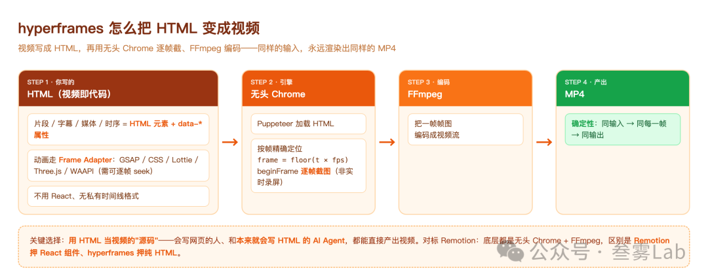

相关链接
- 项目仓库：https://github.com/heygen-com/hyperframes
- 项目主页：https://hyperframes.heygen.com

hyperframes 的聪明之处，不在于渲染技术本身（无头 Chrome + FFmpeg 是成熟组合，Remotion 也这么干），而在于它选了 HTML 作为视频的"源码"——这一个选择，同时讨好了两类作者：会写网页的人，和本来就会写 HTML 的 AI Agent。

当"做视频"被翻译成"写 HTML"，视频就第一次变成了 Agent 能直接产出的东西。对要批量做动态内容、营销视频、或想让 Agent 自动出片的人，这条"写 HTML 就能渲染视频"的路，值得认识一下。

# 参考

https://mp.weixin.qq.com/s/PcKdnLnoZYXaSx2SJJIc3A
