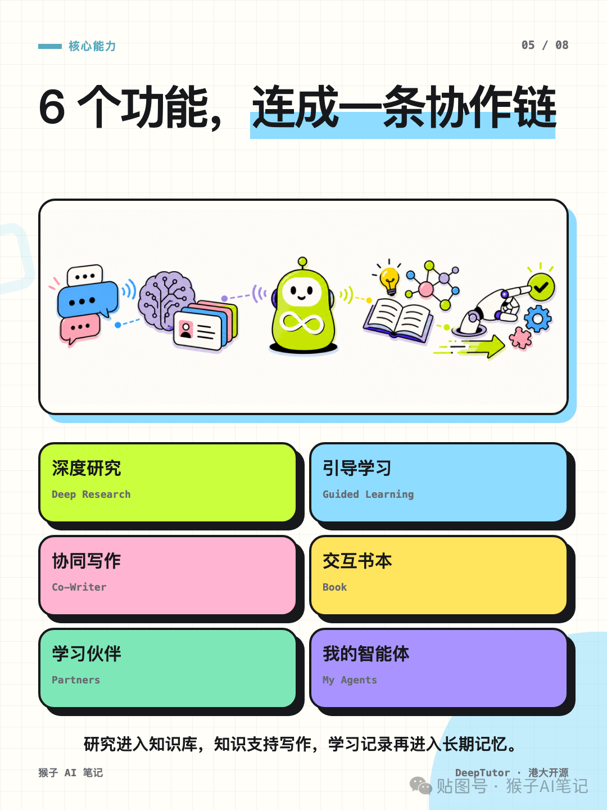

港大开源：DeepTutor，一个私人 AI 家教普通聊天机器人虽然能回答问题，但每次换页面、换任务，往往都要重新解释一遍：你是谁、正在学什么、之前看过哪些资料。

DeepTutor 真正有意思的地方，是把对话、知识、记忆和工具行动接成了一个长期学习闭环。

你可以用它做深度研究、引导学习、协同写作和交互式阅读，也可以创建自己的学习伙伴和智能体。不同功能并不是彼此独立的：研究结果可以进入知识库，知识库继续支持写作，学习记录又会沉淀到长期记忆里。即使切换页面，也不用每次从零开始。

它背后的工作方式也更接近一套“学习操作系统”：上层是对话、书本、课程和写作；中间由智能体负责规划、检索、调用工具和反思；底层再连接大模型、搜索、解析、向量库及本地工作区。

部署方式也比较完整，支持 PyPI、Docker、源码和命令行，可以在本地运行。模型和相关能力可以按自己的成本、隐私和使用场景进行配置。

不过它并不是完全零门槛。正式使用之前，最好先了解模型费用、知识索引配置和工具权限。它更适合愿意折腾开源项目、想自托管，或者正在研究 AI 教育产品的人。

我觉得 DeepTutor 最值得关注的，不是“它回答得像不像老师”，而是它开始真正记住一个人的长期学习过程。

