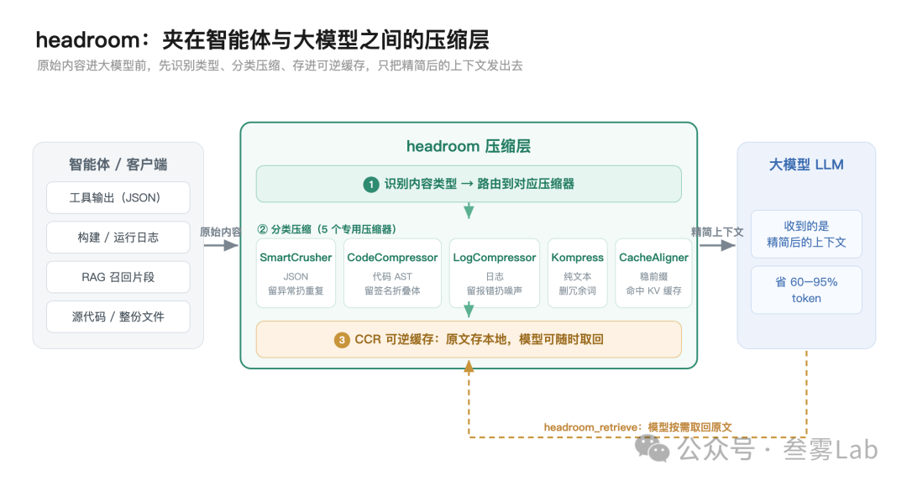

相关链接
- 项目仓库：https://github.com/chopratejas/headroom
- 项目主页：https://chopratejas.github.io/headroom/
- PyPI：https://pypi.org/project/headroom-ai/

同一任务接入 Headroom 前后的 Token 量对比，缩减幅度随内容冗余度变化）

-  代码搜索（100 条结果）：17,765 → 1,408，省 92%
-  SRE 故障排查：65,694 → 5,118，省 92%
-  GitHub issue 分类：54,174 → 14,761，省 73%
-  代码库探索：78,502 → 41,254，省 47%

一、它站在 Agent 和大模型之间

Headroom 不是一个模型，而是一层「中间件」——夹在你的智能体（或任何调用大模型的客户端）和 LLM 之间。内容从智能体出来、进大模型之前，先过它一道。

原理：它不是 gzip，是「按内容类型分治 + 可逆」
这一节是重点，因为 Headroom 的压缩思路和通用压缩完全不同。gzip 这类通用压缩把所有内容当字节流，找重复模式；Headroom 反过来，先认出这段内容是什么，再用对应的办法只留信号、扔掉噪声。

进来的内容先被自动识别类型（JSON、代码、日志、搜索结果、diff、HTML、纯文本），再路由到专门的压缩器：

-  SmartCrusher——管结构化数据（JSON）：面对「一个装着 100 条几乎一样的字典的数组」这种典型工具输出，它做统计分析而不是套死规则，保留报错、异常、边界值，扔掉重复冗余的部分。结构化数据通常能压掉 70–90%。
-  CodeCompressor——管代码：用 tree-sitter 解析出语法树（AST），保留函数签名、导入、类型声明，把函数体折叠掉。逻辑是：大多数时候模型需要的是「有哪些接口、长什么样」，不是每个函数的完整实现。
-  LogCompressor——管日志：留下 error、warning、failure，把一长串「passing」的正常噪声丢掉。一份几千行、99% 都在报「OK」的日志，真正有信息量的就那几行。
-  Kompress——管纯文本：一个基于 ModernBERT 的小模型，对文本逐 token 分类，删掉冗余词、保留语义。
-  CacheAligner——管缓存命中：它不压内容，而是稳定请求的前缀，让 Anthropic / OpenAI 的 KV 缓存真的能命中——否则压缩改动了前缀，缓存反而失效，省下的钱又赔回去。
真正聪明的一步是「可逆」。 上面这些压缩，尤其纯文本那档，是有损的——万一删掉了模型恰好需要的细节怎么办？headroom 的答案是 CCR（Compress-Cache-Retrieve，压缩-缓存-取回）：原文不是删掉，而是存在本地，模型手里多了一个 headroom_retrieve 工具，需要完整内容时随时调出来。

这一步是激进压缩的风险兜底：它不赌「我能 100% 判断什么该删」，而是「删了你还能要回来」。压缩，但不丢失。

# 参考

https://mp.weixin.qq.com/s?__biz=MzYzNDkyODcxNg==&mid=2247483756&idx=1&sn=e6ff8774eda863a3f7fd1b7056fc0142&scene=21&poc_token=HIQ6X2qj7VWkgoO2Lt-F2XERfAZwEQVhjwJR7CCC