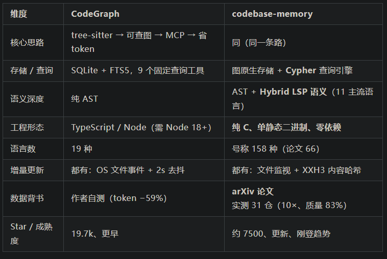

项目仓库：https://github.com/DeusData/codebase-memory-mcp

• 项目主页：https://deusdata.github.io/codebase-memory-mcp/

• 论文：Codebase-Memory: Tree-Sitter-Based Knowledge Graphs for LLM Code Exploration via MCP（arxiv 2603.27277）

