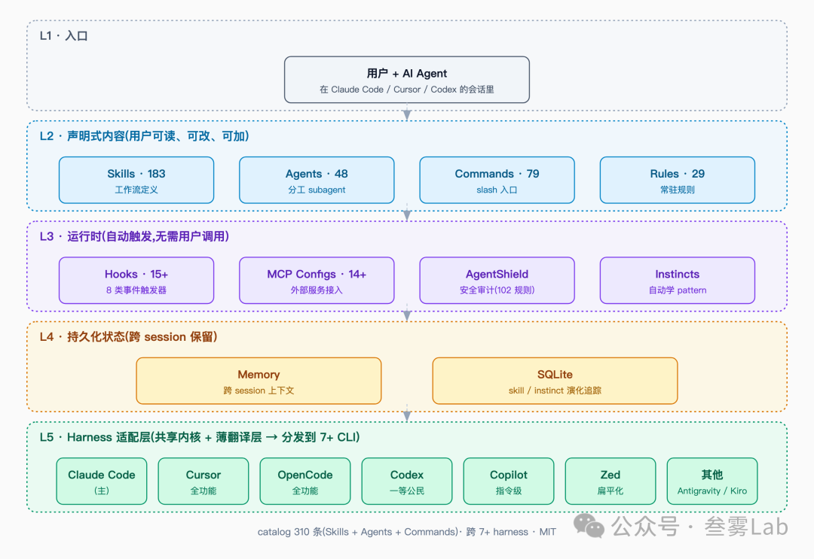

相关链接
• 项目主页：https://github.com/affaan-m/ECC
• 星标趋势：https://api.star-history.com/svg?repos=affaan-m/ECC&type=Date
• 作者：https://github.com/affaan-m

它在解决什么问题
用过 Claude Code / Cursor / Codex 这类 AI Coding Agent 的人，大概都遇到过同一个尴尬：自己在 session 里慢慢调出的好用 prompt、好用的 subagent、好用的 hook，换一台机器就没了。社区的解法是 dotfiles repo —— 把 ~/.claude/、.cursor/、.codex/ 这些目录扔进 git。

但 dotfiles 解决得不彻底：

• 每个 harness 一套配置。你今天换 Claude Code，明天换 Cursor，dotfiles 要复制 / 改写两份
• 配置之外的能力没人管。比如 prompt 是否安全（会不会被 injection）、token context 怎么收敛、跨 session 的记忆怎么持久化、自己写的好 pattern 怎么沉淀成可复用的 skill —— dotfiles 只是文件搬运，不做这些
• 缺少产品级别的内容。dotfiles 里一般是个人偏好，不是经过实战打磨的 skill / agent
ECC 的主张：这不该是 dotfiles 的活儿，应该有一个完整的工程化底座来承担。

作者把 ECC 叫做 "operator system"（注意不是 Linux/macOS 那种 OS）—— 意思是给 AI Coding Agent 外挂一层标准化的工程能力：技能、子代理、钩子、安全审计、跨 session 记忆、pattern 沉淀。Agent 在这一层之上工作，而不是直接裸跑。

作者在主页中是这么介绍的："a complete system, not a config pack"。

5 层从上到下：入口 → 声明式内容 → 运行时 → 持久化 → Harness 适配。颜色对应层职责，方便快速定位某个模块属于哪一层）

简单解释 5 层各自做什么：

• L1 入口：用户跟 Agent 在 Claude Code / Cursor / Codex 这些 CLI 里的会话本身
• L2 声明式内容：用户可读、可改、可自加的 markdown 资产，包括 Skills、Agents、Commands、Rules 四类
• L3 运行时：自动跑起来的能力 —— Hooks 监听 session 事件，MCP Configs 接外部服务，AgentShield 扫安全，Instincts 自动学 pattern
• L4 持久化：跨 session 保留的状态 —— Memory 存上下文，SQLite 追踪 skill 和 instinct 的演化
• L5 Harness 适配：把 ECC 的标准内容分发到 7+ 个 CLI 的薄翻译层

参考：https://mp.weixin.qq.com/s?__biz=MzYzNDkyODcxNg==&mid=2247483709&idx=1&sn=a05e1b1d7b5ce7c92a096c631108d7e2&scene=21&poc_token=HDhVX2qjoT59wjE-1lA1d5i3C2ORkztnDRY0L0Si