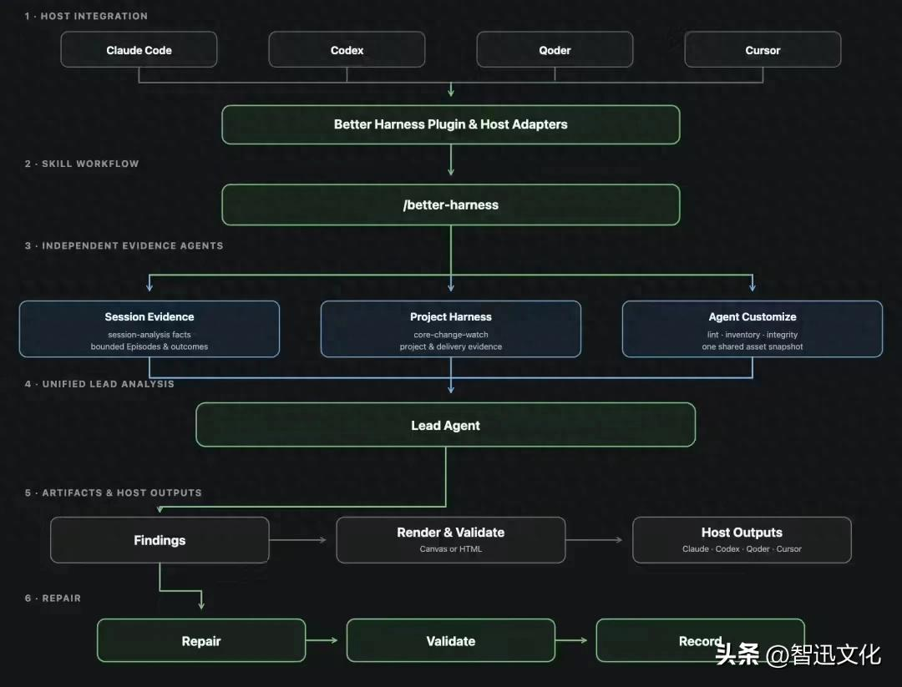

Better Harness的核心逻辑是：不把“配置存在”视为能力生效，而是动态检查Agent是否真正使用了相关能力、以及这些能力是否支持任务完成。每条检查结果都必须附带可追溯证据、用户影响、修复范围和验证方式。简单说，它不是在问“你装了哪些插件”，而是在问“你干活的时候到底用了哪些本事、用到位了没有”。

这套工具之所以能做到这一点，得益于它的三层开源架构。第一层是Harness Engineering实践，覆盖会话管理、命令行交互、可观测性、Rules、Skills、MCP、Memory、Hooks和自动化等9大核心模块；第二层是Agent Work Loop评估模型，把工程实践转化为可逐项检查的问题，并规范证据、评分与结论之间的关系；第三层是可运行的工程实现，让前两层不只停留在文档里，而是能在真实项目中重复运行。

在证据采集层面，Better Harness会独立采集三类数据：Session Evidence（会话记录）、Project Harness（项目配置）和Agent Customize（Agent定制参数）。首轮内部评测已覆盖30个GitHub真实项目。工具适配了Claude Code、Codex、Qoder和Cursor等多种主流AI编程工具，开发者可自由接入。

# 参考

https://www.toutiao.com/article/7667822958315831823/?app=news_article&category_new=__all__&module_name=Android_tt_others&share_did=MS4wLjACAAAAfpDr-ijO6LMaBG3guMzOCQ10tRyBPlAqr9XYy74tPPg&share_uid=MS4wLjABAAAASJ52mqDdigxLhqMJfM5ZomQxfcafAdqZtTMnWgi93p0&timestamp=1785681412&tt_from=wechat&upstream_biz=Android_wechat&utm_campaign=client_share&utm_medium=toutiao_android&utm_source=wechat&share_token=ca185841-221f-487a-b169-ac35b5fbe7df&source=m_redirect